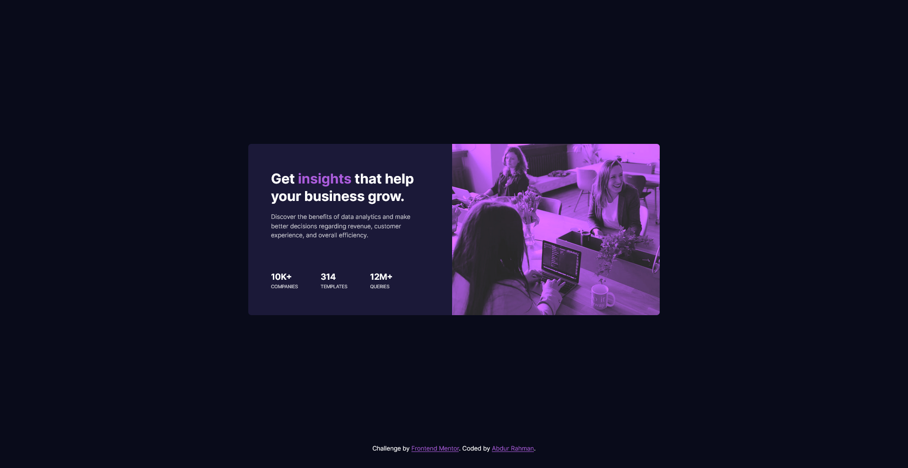

# Frontend Mentor - Stats preview card component solution

This is a solution to the [Stats preview card component challenge on Frontend Mentor](https://www.frontendmentor.io/challenges/stats-preview-card-component-8JqbgoU62). Frontend Mentor challenges help you improve your coding skills by building realistic projects.

## Table of contents

- [Overview](#overview)
  - [The challenge](#the-challenge)
  - [Screenshot](#screenshot)
  - [Links](#links)
- [My process](#my-process)
  - [Built with](#built-with)
  - [What I learned](#what-i-learned)
  - [Continued development](#continued-development)
  - [Useful resources](#useful-resources)
- [Author](#author)

## Overview

### The challenge

Users should be able to:

- View the optimal layout depending on their device's screen size

### Screenshot



### Links

- Solution URL: [Solution](https://github.com/nuraf9607/fm-stats-preview-card)
- Live Site URL: [Live Site](https://your-live-site-url.com)

## My process

### Built with

- Semantic HTML5 markup
- CSS custom properties
- Flexbox
- CSS Grid

### What I learned

Today I have learnt some new properties called filter and mix-blend-mode

```html
<div class="section__image">
        

  </div>
```

```css
.section__image {
  position: relative;
  filter: brightness(1.4) contrast(70%) saturate(160%);
}
.section__image img {
  mix-blend-mode: multiply;
}
```


### Continued development

I would like to continue learning about new properties that are left unexplored.

**Note: Delete this note and the content within this section and replace with your own plans for continued development.**

### Useful resources

- Nothing new 

## Author

- Website - Don't have it yet
- Frontend Mentor - [@nuraf9607](https://www.frontendmentor.io/profile/nuraf9607)
- Twitter - [@theAbdurRahman1](https://x.com/theAbdurRahman1)


